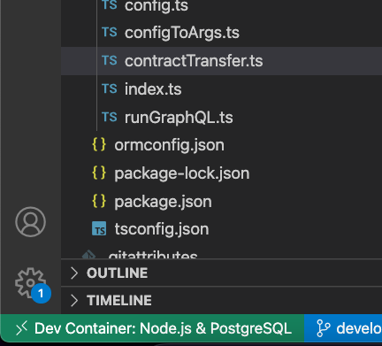
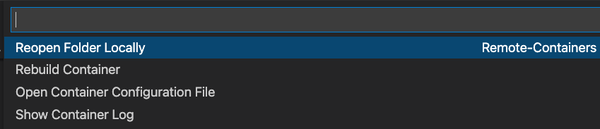
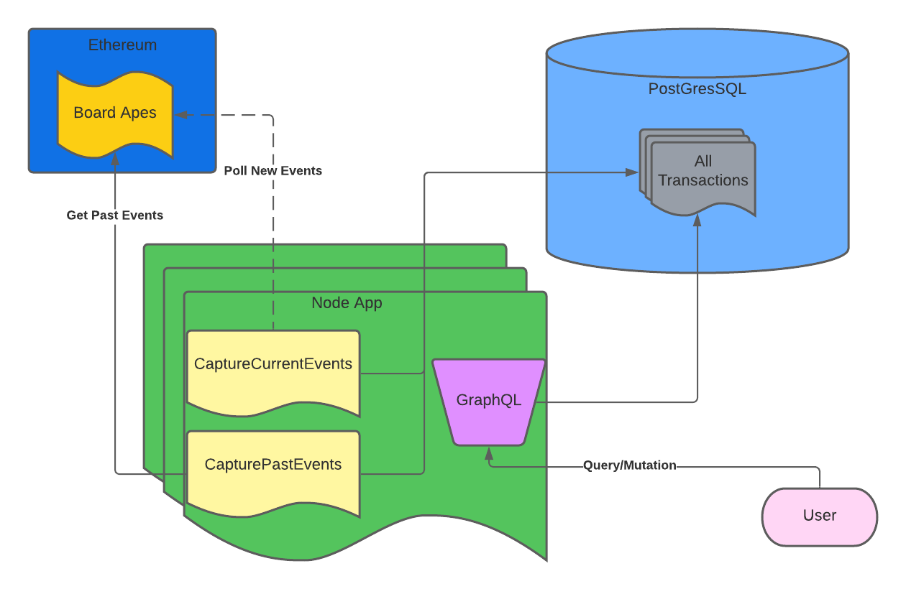

# Overview

This project is written in Typescript to complete the coding challenge for N[FT.com.](http://nft.com/ "http://NFT.com")

## Disclaimer

Over the last few weeks, I have been learning JS, understanding new topics, and writing more code in JS. Once I learned that the team uses Typescript, I thought it would be a great opportunity to do the following.

1.  Write JS code for a real project.

2.  Learn how to write code in Typescript.

3.  Challenge myself to step out of my comfort zone.

4.  Show my capabilities of writing code in a new language.


I decided to complete this project in Typescript instead of a language I am comfortable in. I also want to indicate that I **spent more than three hours on this project.**

-   I was able to complete all of the requirements for this project under the three-hour mark.

    -   Setting up GraphQL

    -   Creating a schema

    -   Adding Queries and Mutations.

-   But I spent quite a bit of time playing around with web3.js and Typescript. This is evident in the functionality to query for past events. Although this wasn’t a requirement of the project, I wanted to expose myself to new concepts further and add more tools to my belt.


# Setup

This project is built inside a docker container. The recommended setup is as follows. VScode has instructions on opening Github repositories in a [VScode container.](https://code.visualstudio.com/docs/remote/containers#_quick-start-open-a-git-repository-or-github-pr-in-an-isolated-container-volume "https://code.visualstudio.com/docs/remote/containers#_quick-start-open-a-git-repository-or-github-pr-in-an-isolated-container-volume") But the TLDR is as follows:

1.  Open the repository in VScode.

2.  Click the green icon on the bottom right of your screen

    

3.  Click `Rebuild Container`

    


## Database

The database used in this container is **not** persistent. A persistent DB made testing difficult. Please keep this in mind.

# Application Overview



At a high level, the application does the following:

1.  Setups the Postgres DB and starts up graphQL.

    1.  The schema will be implemented on the Postgres DB.

    2.  The graphQL server will start.

2.  The application to listen for new `Transfer` events on the contract address.

    1.  It adds new events to the DB.

3.  The application will query past `Transfer` events on the contract address.

    1.  It will add all the past events to the DB.


## Configuration File

This application uses a configuration file. You can also pass in all the parameters via the command line if you choose. An example config file:

```
{
    "infrastructure": {
        "infuraKey": "xxxxxxxx",
        "etherScanApiKey": "aaaaaaa"
    },
    "contract": {
        "contractAddress": "0xBC4CA0EdA7647A8aB7C2061c2E118A18a936f13D",
        "includePastTransactions": true,
        "contractStartBlock": 12287507,
        "startBlock": 14145035,
        "endBlock": 14146039,
        "pastQueryDelimeter": 10000
    },
    "dbConnection": {
        "newEventsConnection": "newEventsConnection",
        "pastEventsConnection": "pastEventsConnection",
        "graphqlPort": 4001,
        "checkDuplications": true
    }
}
```

Most parameters are straightforward. The parameters users might want to update are as follows:

-   `contractAddress` - Update the contract address to watch.

-   `includePastTransactions`- Indicate if they want past transactions or not.

-   `contractStartBlock` - What is the contract creation block number.

    -   This is used if the `startBlock` is set to `earliest`.

-   `startBlock` - The block to start at.

    -   A number or `earliest` is acceptable.

-   `endBlock` - The block to end at.

    -   A number or `latest` is acceptable.

    -   **If** `latest` is **used** - The application must process a “live” transfer to determine the `latest` block is. The application will get all the past transactions after the `latest` block number has been determined.

-   `pastQueryDelimeter` - The application queries the past events in “chunks.” Infura has a query limit of `10000`, therefore it is recommended that users stick to this number or lower.

-   `graphqlPort` - The port graphQL will expose.

-   `checkDuplications` - Should the application check for duplicate events based on the `transactionHash` before inserting them into the DB?


## Start the Application

To start the application, do the following:

`1cd ContractWatcher/ 2ts-node src/index.ts`

## Interact with GraphQL

Open up the application on the port you configured. Currently, the application runs on `localhost`. Please view the upcoming sections to view the queries and mutations.


# Queries

## Query All Events

This query will provide you with all the events in the database

```
query Query {
  events {
    contractAddress
    transactionHash
    blockNumber
    fromAddress
    toAddress
    tokenId
    isRead
  }
}
```

## Query By Contract Address

This query will filter for the specified contract address.

```
query Query($contractAddress: String!) {
  contracts(contractAddress: "0xBC4CA0EdA7647A8aB7C2061c2E118A18a936f13D") {
    contractAddress
    transactionHash
    blockNumber
    fromAddress
    toAddress
    tokenId
    isRead
  }
}
```

## Query All Unread Events

This will return all events for which the following statement is true: `isRead === false`

```
query Query {
  allUnread {
    contractAddress
    transactionHash
    blockNumber
    fromAddress
    toAddress
    tokenId
    isRead
  }
}
```

## Query by Address and TokenId

You can query the `tokenId` with a variety of addresses. The below captures the type of address you can use.

### `ContractAddress` and `tokenId`

```
query Query($contractAddress: String!, $tokenId: Float!) {
  allContractAddressAndTokenId(contractAddress: "0xBC4CA0EdA7647A8aB7C2061c2E118A18a936f13D", tokenId: 4049) {
    contractAddress
    transactionHash
    blockNumber
    fromAddress
    toAddress
    tokenId
    isRead
  }
}

```

### `fromAddress` and `tokenId`

```
query Query($tokenId: Float!, $fromAddress: String!) {
  allFromAddressAndTokenId(tokenId: 9149, fromAddress: "0xC310e760778ECBca4C65B6C559874757A4c4Ece0") {
    contractAddress
    transactionHash
    blockNumber
    fromAddress
    toAddress
    tokenId
    isRead
  }
}

```

### `toAddress` and `tokenId`

```
query Query($allToAddressAndTokenIdTokenId2: Float!, $toAddress: String!) {
  allToAddressAndTokenId(tokenId: 9149, toAddress: "0x5d23B4ea39E274b23fdEa9bFDb57b032AcEd47d4") {
    contractAddress
    transactionHash
    blockNumber
    fromAddress
    toAddress
    tokenId
    isRead
  }
}
```

# Mutation

## Mark Events Read or Unread

The parameter to mark an event read or unread is `isRead - (Bool)`.

-   If `isRead == true`, the event has been read.

-   If `isRead == false`, the event has not been read.


You can mark `isRead` true or false. You must query events by the `contractAddress` and `tokenId`

```
mutation Mutation {
  markReadOrUnread (
    contractAddress: "0xBC4CA0EdA7647A8aB7C2061c2E118A18a936f13D",
    tokenId: 4049,
    isRead: true
  ) {
    transactionHash
    isRead
  }
}
```

# Improvements

1.  **Improving Past Events -** Currently, the application _can_ view past events, but not all of them. The application runs into various bugs if the block range is too large. I haven’t had the time to debug them all. Therefore, it is recommended to stick to the current range. Feel free to use a larger block range, but keep in mind that the application might fail.

2.  **Making Some Functions More Robust -** Primarily the database functions. They have been written to handle a specific read/write use case for the application. But with a simple refactor, users can specify the `where` and `insert` queries to make the functions more robust.

3.  **Use Cloud Infrastructure -** Currently, the application only runs locally; using cloud infrastructure would make the application more robust.

4.  **Add Testing -** Currently, the application is tested manually; adding some automated tests would be great.